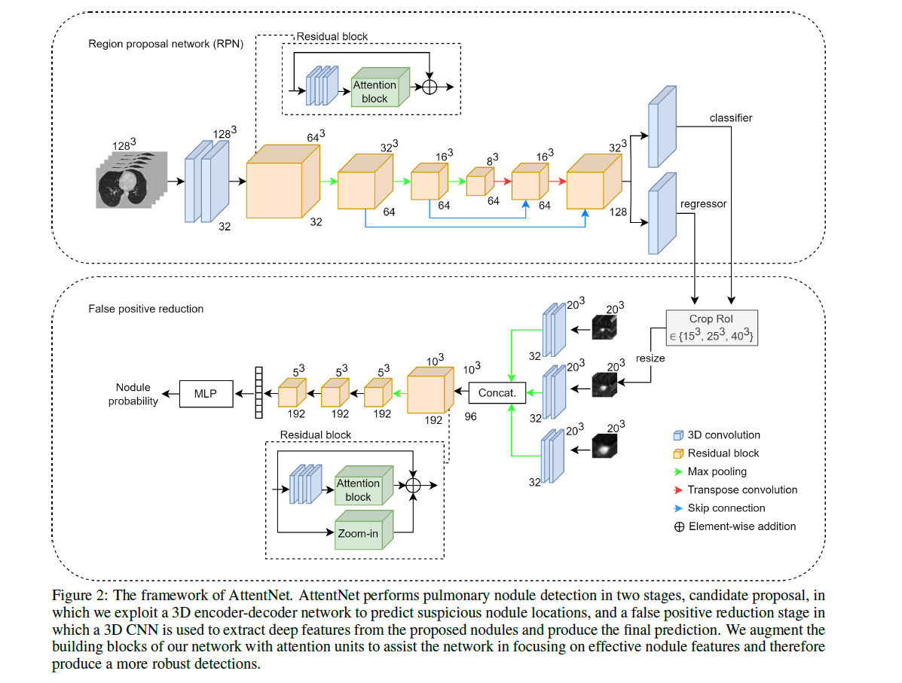

# AttentNet: Fully Convolutional 3D Attention for Lung Nodule Detection


This repository contains the code and resources for [AttentNet](https://arxiv.org/abs/2407.14464), an automated lung nodule detection system based on 3D convolutional attention mechanisms. AttentNet operates in two stages:

1. **Region Proposal Network (RPN)**: Proposes candidate nodule locations.
2. **False Positive (FP) Reduction**: Refines the predictions to reduce false positives.

# Abstract
<div style="text-align: justify;">
Motivated by the increasing popularity of attention mechanisms, we observe that popular convolutional (conv.) attention models like Squeeze-and-Excite (SE) and Convolutional Block Attention Module (CBAM) rely on expensive multi-layer perception (MLP) layers. These MLP layers significantly increase computational complexity, making such models less applicable to 3D image contexts, where data dimensionality and computational costs are higher. In 3D medical imaging, such as 3D pulmonary CT scans, efficient processing is crucial due to the large data volume. Traditional 2D attention generalized to 3D increases the computational load, creating demand for more efficient attention mechanisms for 3D tasks. We investigate the possibility of incorporating fully convolutional (conv.) attention in 3D context. We present two 3D fully conv. attention blocks, demonstrating their effectiveness in 3D context. Using pulmonary CT scans for 3D lung nodule detection, we present AttentNet, an automated lung nodule detection framework from CT images, performing detection as an ensemble of two stages, candidate proposal and false positive (FP) reduction. We compare the proposed 3D attention blocks to popular 2D conv. attention methods generalized to 3D modules and to self-attention units. For the FP reduction stage, we also use a joint analysis approach to aggregate spatial information from different contextual levels. We use LUNA-16 lung nodule detection dataset to demonstrate the benefits of the proposed fully conv. attention blocks compared to baseline popular lung nodule detection methods when no attention is used. Our work does not aim at achieving state-of-the-art results in the lung nodule detection task, rather to demonstrate the benefits of incorporating fully conv. attention within a 3D context.
<div>


<div align="center">
    
</div>


## Dataset
- **LUNA16 Dataset**: Trained and evaluated on the [LUNA16](https://luna16.grand-challenge.org/Data/) lung nodule dataset. 

## Requirements

- `opencv-python`
- `numpy`
- `torch`
- `sklearn`
- `tqdm`
- `scipy`

```bash
pip install opencv-python numpy torch sklearn tqdm scipy
```


## Installation
Clone the repository:

```bash
    git clone https://github.com/MjdMahasneh/AttentNet/tree/master
    cd AttentNet
```

## Usage

modify the following key arguments as desired:

| Argument           | Description                                                 |
|---------------------|-------------------------------------------------------------|
| `--model`          | Specifies the model architecture.                          |
| `--epochs`         | Total number of epochs to run during training.             |
| `--batch-size`     | Number of samples in each mini-batch.                      |
| `--lr`             | Initial learning rate for training.                        |
| `--momentum`       | Momentum factor for the optimizer.                         |
| `--weight-decay`   | L2 regularization to prevent overfitting.                  |
| `--save-dir`       | Directory to save checkpoints and training results.        |
| `-i`               | Cross-sectional views for training/testing (e.g., axial).  |
| `--train-set`      | Path to the training dataset.                              |
| `--test-set`       | Path to the testing dataset.                               |


#### Training the Lung Nodule Detector


- `./main.py`: Implements the Region Proposal Network (RPN) for generating lung nodule candidates, utilizing 3D convolutional attention for enhanced feature extraction and localization.
- `./FP_reduction/main.py`: Implements the False Positive (FP) reduction stage, which refines the candidates produced by the RPN by reducing false positives, improving the overall detection accuracy.

#### NOTE: this repo is work in progress and will be updated soon with more features and improvements.
